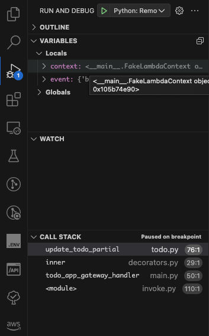
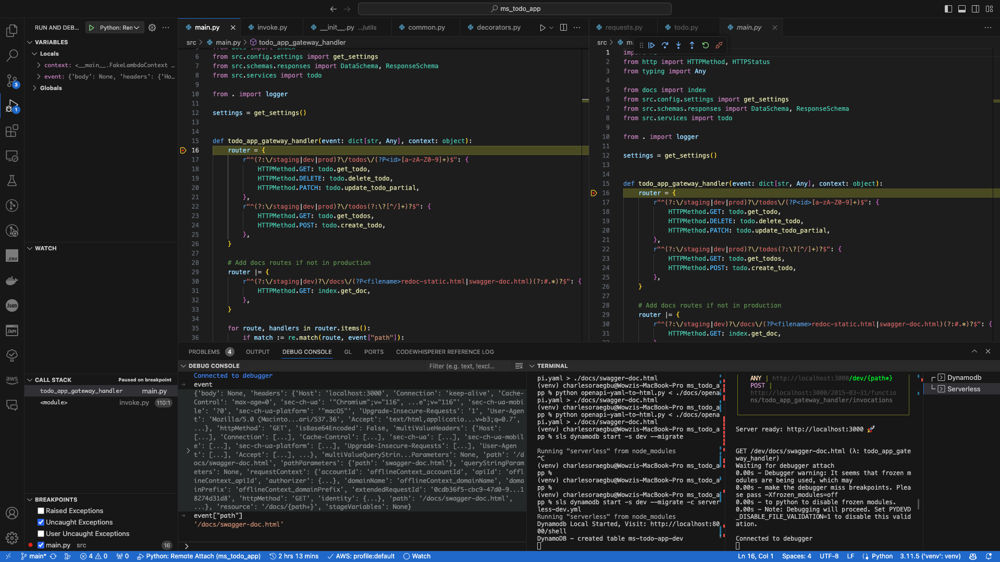

## Table of Contents

- [TODO APP](#todo-app)
- [Installations](#installations)
  - [Node](#node)
    - [Offline configuration tweaks](#offline-configuration-tweaks)
  - [Python](#python)
  - [Serverless](#serverless)
- [Start offline](#start-offline)
  - [Dynamodb offline](#dynamodb-offline)
  - [Serverless offline](#serverless-offline)
    - [NOTE: Once you call an endpoint you will be required to start the debugger which is a green button on the debugger menu see images below; ](#note-once-you-call-an-endpoint-you-will-be-required-to-start-the-debugger-which-is-a-green-button-on-the-debugger-menu-see-images-below-)
  - [Debugging session](#debugging-session)
- [To update swagger docs](#to-update-swagger-docs)

# TODO APP

This is a simple CRUD todo app built with Serverless X Dynamodb

# Installations

## Node

Ensure you have node installed and in parent directory run;

```
  npm install
```

### Offline configuration tweaks

From the [`${PWD}/node_modules/serverless-offline/src`](node_modules/serverless-offline/src);

- [ ] Goto the [`config/supportedRuntimes.js`](node_modules/serverless-offline/src/config/supportedRuntimes.js#L30) file and add your python version if not already included.
- [ ] Goto the [`lambda/handler-runner/python-runner/invoke.py`](node_modules/serverless-offline/src/lambda/handler-runner/python-runner/invoke.py#L12) and add the script below from line 12

```
import debugpy

if os.environ.get("DEBUG", "false").lower() == "true":
  print("Waiting for debugger attach")
  if debugpy.is_client_connected() is False:
      os.system("lsof -t -i tcp:5678 | xargs kill -15")
      debugpy.listen(5678)
      debugpy.wait_for_client()
      print("Connected to debugger")
```

## Python

Run the commands below to setup python requirements in a virtual environment

```
  python -m venv venv
  source venv/bin/activate

  pip install -r requirements.txt

```

## Serverless

Install serverless plugins

```
  serverless plugin install -n serverless-dynamodb -s dev
  serverless plugin install -n serverless-offline -s dev
```

# Start offline

## Dynamodb offline

Start dynamoDB inMemory storage

```
sls dynamodb start --migrate -c serverless-dev.yml
```

## Serverless offline

```
DEBUG=true sls offline start -s dev -t
```

`-t` to prevent timeouts (apigateway 30s timeouts for example)

Live swagger doc @ [swagger-doc](http://localhost:3000/dev/docs/swagger-doc.html) & Redoc doc @ [redoc](http://localhost:3000/dev/docs/redoc-static.html)

### NOTE: Once you call an endpoint you will be required to start the debugger which is a green button on the debugger menu see images below; 

## Debugging session



# To update swagger docs

```
./build-docs
```
